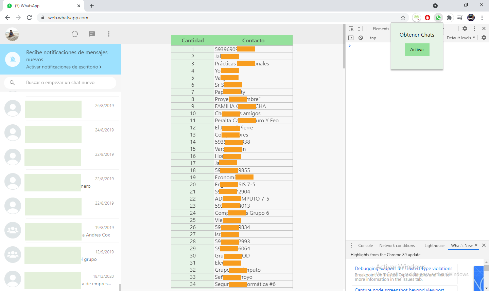

# Obtener-Contactos-WhasApp
Complemento para obtener los contactos de WhatsApp mediante el navegador Chrome

## Pre-requisitos 📋
_Navegador basado en Chromium_

## Construido con 🛠️
**(Front-End)**
* [Javascript] - Para programación Front-End.
* [CSS] - Para la presentación del documento.
* [HTML] - Para la elaboración de páginas web.

## ❤️❤️❤️ Sitio Web Mobile (_Haga click a la imagen_) ❤️❤️❤️

  

